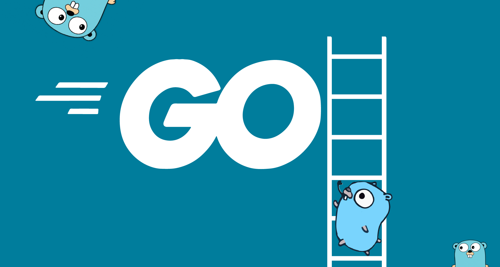

<br/>

import Series from "../src/components/series";

<Series series={[
    {
        linkLabel: "Basic Golang Part 1",
        link: "https://narawit.dev/2022/basic-golang-part-1/",
        title: "Basic Syntax"
    },
    {
        linkLabel: "Basic Golang Part 2",
        link: "https://narawit.dev/2022/basic-golang-part-2/",
        title: "Pointers, Structs, Slices, Maps, Functions"
    },
    {
        linkLabel: "Basic Golang Part 3",
        link: "https://narawit.dev/2022/basic-golang-part-3/",
        title: "Interfaces, Methods, Goroutines"
    },
]} seriesName="Golang The Series"/>

ภาษา Go หรือว่า Golang เป็นภาษาในฝั่งของ Server Side ที่ถูกสร้างขึ้นเมื่อปี 2007 โดย Google และได้มีการเผยแพร่ออกมาให้เหล่า Developers ได้ใช้กันในปี 2009
Golang ถูกคิดค้นมาเพื่อแก้ปัญหาโปรเจ็คในระดับสเกลใหญ่ๆ และรองรับ concurrency ได้ในจำนวนมาก และในปัจจุบันยังถูกใช้เป็นส่วนหลักๆของหลายๆ Project ใน Google

เห็นความสามารถของภาษา Go แล้ว วันนี้เรามาเริ่มเรียนรู้ Syntax ง่ายๆในการเขียนภาษา Go กัน

## Variables (การประกาศตัวแปร)
Golang เป็นภาษาที่มีการประกาศตัวแปรเป็นแบบ `Static Type` คือเมื่อตัวแปรถูกประกาศขึ้นมาแล้วจะไม่สามารถเปลี่ยงแปลง type ของตัวแปรนั้นได้
```go
package main

// การประกาศตัวแปรแบบปกติ
func main() {
    var i int = 10
    var s string = "Hello World"
    var intArray [5]int = [5]int{1,2,3,4,5}
    var intSlice []int = []int{1,2,3,4,5}
}
```
```go
package main

// หรืออีกอย่างเรียกว่า short variable declarations
// โดยใช้ := short assignment statement
// แต่การใช้คำสั่งพวกนี้ต้องอยู่ในฟังก์ชันเท่านั้น
func main() {
    i := 10
    s := "Hello World"
    intArray := [5]int{1,2,3,4,5}
    intSlice := []int{1,2,3,4,5}
}
```

## Type conversions (การแปลงประเภทของตัวแปร)
ด้วยความที่ Golang เป็น static type การที่เราจะ assign value ของตัวแปรอีก type นึงไปใส่อีก type นึงไม่สามารถทำได้
ต้องทำการเปลี่ยนแปลง type ให้เป็น type เดียวกันกับตัวแปรนั้นเสียก่อน ที่เราจะนำค่าไปใส่
```go
package main

// หรืออีกอย่างเรียกว่า short variable declarations
// โดยใช้ := short assignment statement
// แต่การใช้คำสั่งพวกนี้ต้องอยู่ในฟังก์ชันเท่านั้น
func main() {
    var f float64 = 3.14
	var i int = f // Cannot use 'f' (type float64) as the type int
    // ต้องทำการแปลงค่า f เป็น int ก่อนโดยการ
    var i int = int(f)
}
```
หรือในกรณีที่เป็น short variable declarations
```go
package main

func main() {
    f := 3.14
	i := int(f)
}
```

## Type inference (การอนุมาน)
ในเมื่อ Golang ไม่ได้เป็น dynamic type เหมือนภาษาอื่นๆเช่น Js, Php แต่อนุญาติให้ประกาศตัวแปรแบบสั้นๆได้โดยไม่ต้องใส่ type
จึงต้องมีสิ่งที่เรียกว่าการอนุมาน หรือ การกำหนดประเภทตัวแปรให้เองโดยอัติโนมัติ
```go
package main

import "fmt"

func main() {
    s := "Hello World"
    i := 2
    f := 3.5

    // ลอง print type ออกมาดู โดยใช้คำสั่ง
    fmt.Printf("s is of type %T\n", s) // s is of type string
    fmt.Printf("i is of type %T\n", i) // i is of type int
    fmt.Printf("f is of type %T\n", f) // f is of type float64
}
```

## For Loop
ในภาษา Golang มี `loop` เพียงชนิดเดียวคือ `the for loop` บางคนอาจจะเคยเขียนภาษาอื่นมาก่อนนอาจจะแปลกใจ เราลองมาดูกันว่ามันเขียนยังไง
```go
package main

import "fmt"

func main() {
    for i := 0; i < 10; i++ {
        fmt.Println(i)
    }
}
```

พื้นฐาน for loop จะประกอบด้วย 3 ส่วนนี้
1. `init statement (ค่าเริ่มต้น)` execute ก่อน loop ครั้งแรกจะทำงาน
1. `condition expression (เงื่อนไขในการ loop)` จะเช็คเงื่อนไขนี้ทุกครั้งที่ loop ทำงาน
1. `post statement` execute ทุกครั้งหลังจบการลูบแต่ละครั้ง

<br/>

### For continued
หลักการทำงานคล้ายๆ While loop ในภาษาอื่น คือเราสามารถจะ omit หรือว่าไม่ใส่ ตัว init และ post statement ก็ได้
```go
package main

import "fmt"

func main() {
    sum := 0

    for ; sum < 100; {
        sum += 10
    }
}
```

> For is Go's "while" แปลไทยคือ while loop ใน Go ก็คือ for นั่นเอง

```go
package main

import "fmt"

func main() {
    sum := 0

    for sum < 100 {
        sum += 10
    }
}
```
ตราบใดที่ sum มีค่าน้อยกว่า 100 loop จะยังคงทำงานต่อไปเรื่อยๆ

<br />

### Infinite Loop
```go
package main

func main() {
    sum := 0

    for {
        fmt.Println("เมื่อไหร่ลุงจะออก")
    }
}
```

## IF ELSE
ความพิเศษของ IF ELSE statement ใน Golang คือ สามารถประกาศตัวแปรก่อนที่จะเช็คเงื่อนไขได้

> ตัวแปรที่ถูกประกาศใน IF statement สามารถเข้าถึงได้จนจบ IF ELSE scope เท่านั้น

```go
package main

import (
	"fmt"
	"math"
)

func pow(x, n, lim float64) float64 {
	if v := math.Pow(x, n); v < lim {
		return v
	} else {
		fmt.Printf("%g >= %g\n", v, lim)
	}
	// ไม่สามารถใช้ตัวแปร v ตรงนี้ได้
	return lim
}

func main() {
	fmt.Println(
		pow(3, 2, 10),
		pow(3, 3, 20),
	)
}
```

## Switch
การเขียน `Switch Statement` ในภาษา `Golang` ก็เหมือนกับภาษาอื่นทั่วไปอาจจะแตกต่างตรงนี้พอเข้าเงื่อนไขแล้ว ไม่ต้องใช้คำสั่ง `break`
แต่มันจะหยุดทำงานเองโดยอัติโนมัติ
```go
package main

import (
	"fmt"
)


func main() {
    switch d := "Monday"; d {
    case "Monday":
        fmt.Println("Today is Monday")
    case "Sunday":
        fmt.Println("Today is Sunday")
    default:
        fmt.Println("Everyday is someday")
    }
}
```

> สามารถที่จะ Omit condition ก็สามารถทำได้

```go
package main

import (
	"fmt"
)

func main() {
	d := "Sunday"

	switch  {
	case d == "Monday":
		fmt.Println("Today is Monday")
	case d == "Sunday":
		fmt.Println("Today is Sunday")
	default:
		fmt.Println("Everyday is someday")
	}
}
```
สามารถที่จะใช้วิธีนี้แทน if-then-else ก็ได้

## Defer
> A defer statement defers the execution of a function until the surrounding function returns.

defer จะเลื่อนเวลา execution ออกไปจนกว่าการทำงานรอบๆตัวจะทำเสร็จ แล้วจึงค่อยทำ defer statement
```go
package main

import "fmt"

func main() {
	defer fmt.Println("world")

	fmt.Println("hello")
}
```
```text
hello
world
```

### Stacking defers
การทำงานของ defer statement ในแต่ละครั้งจะถูก โยนไปใส่ stack เอาไว้ deferred calls จะมีการทำงานแบบ
`last-in-first-out order (LIFO)` ค่าสุดท้ายที่ถูกโยนเข้ามาใน stack จะถูกนำออกไปก่อน
```go
package main

import "fmt"

func main() {
	fmt.Println("counting")

	for i := 0; i < 10; i++ {
		defer fmt.Println(i)
	}

	fmt.Println("done")
}
```
```text
counting
done
9
8
7
6
5
4
3
2
1
```

<br />

สำหรับในส่วนของ Part 1 ก็จะทิ้งไว้ประมาณนี้นะครับหวังว่าเพื่อนๆจะชอบกัน ในส่วนของบทความหน้าเราจะมาต่อกันด้วยเรื่องของ
- Pointers
- Structs
- Arrays
- Slices
- Maps
- Functions
