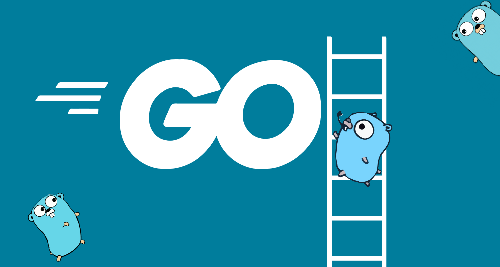
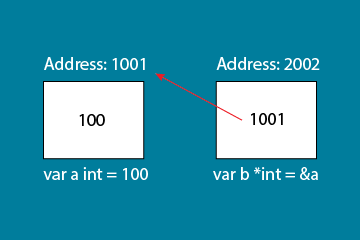

<br/>

import Series from "../src/components/series";

<Series series={[
    {
        linkLabel: "Basic Golang Part 1",
        link: "https://narawit.dev/2022/basic-golang-part-1/",
        title: "Basic Syntax"
    },
    {
        linkLabel: "Basic Golang Part 2",
        link: "https://narawit.dev/2022/basic-golang-part-2/",
        title: "Pointers, Structs, Slices, Maps, Functions"
    },
    {
        linkLabel: "Basic Golang Part 3",
        link: "https://narawit.dev/2022/basic-golang-part-3/",
        title: "Interfaces, Methods, Goroutines"
    },
]} seriesName="Golang The Series"/>

จากในบทความก่อนหน้านี้ เราได้เกริ่นถึง Basic Syntax ในภาษา Go ไปแล้ว ในบทความนี้ เราจะมาพูดถึงสิ่งที่มัน Advanced ขึ้นมาสักนิดนึงเทียบจากบทที่แล้วนะครับ

## Pointers
> Pointer คือ Object หรือตัวแปรใดๆที่ เก็บ Memory Address ของตัวแปรที่มันชี้ไปถึง

<br />



<br />

คำอธิบายรูปภาพข้างบนคือ ทำการประกาศตัวแปร a ขึ้นมาเป็น type int โดยมีค่า = 100 จากนั้นประกาศตัวแปร b เป็น `pointer (*)` ประเภท int ที่ทำการ point ไปที่ตัวแปร a
จะสังเกตุว่า ตัวแปร b ไม่ได้ทำการเก็บค่าของตัวแปร a โดยตรง แต่จะเป็นการเก็บ Address ใน memory ของตัวแปร a ไว้

<br />

* `&` คือ operator ที่ทำหน้าที่ในการ return ค่าของ address ของตัวแปรนั้นๆ
```
var a int = 100
var b *int = &a
fmt.Println(b) // 0xc0000b1001 เป็น Address ใน memory ไม่ใช่ value ของตัวแปร a ที่ b point ไปถึง
```

*  `*` คือ pointer ที่จะทำการชี้ไปถึง value ของ Address ของตัวแปรนั้นๆ
```
var a int = 100
var b *int = &a
fmt.Println(*b) // 100
```
สรุปก็คือ ถ้าเราอยากที่จะแสดงค่าของตัวแปรที่เรา point ไปถึงจะต้องใช้คำสั่ง *T มิฉะนั้น ค่าที่ได้จะกลายเป็น Address ของตัวแปรที่เรา point ไปถึงนั่นเอง

<br/>

## Structs
> Struct คือ collection ของ fields

Struct ในภาษา Go ถ้าเปรียบเทียบกับภาษาอื่นๆ อาจจะเรียกได้ว่าเป็น Object สามารถที่จะเข้าถึง field ใน struct โดยใช้ `dot notation`

```go
package main

import "fmt"

type Vertex struct {
	X int
	Y int
}

func main() {
	v := Vertex{1, 2}
	v.X = 4
	fmt.Println(v.X) // 4
}
```

<br/>

### Pointers to structs
Pointers ก็สามารถใช้กับ Structs ได้เช่นกัน
```go
package main

import "fmt"

type Vertex struct {
	X int
	Y int
}

func main() {
	v := Vertex{1, 2}
	p := &v
    p.X = 10
	fmt.Println(v) // {10 2}
}
```

<br/>

### Struct Literals
> Literal คือ สัญลักษณ์ หรือ วิธีการในการกำหนดค่าของตัวแปรที่เราต้องการจะใช้


อย่างในกรณีของ `Struct Literals` เราต้องการที่จะประกาศตัวแปรที่เป็น struct ขึ้นมาโดยต้องการที่จะกำหนดค่าเริ่มต้นของ fields ใน struct

```go
package main

import "fmt"

type Vertex struct {
	X, Y int
}

var (
	v1 = Vertex{1, 2}  // มี type เป็น Vertex
	v2 = Vertex{X: 1}  // Y:0 จะถูกกำหนดค่าโดย zero value โดยอัติโนมัติ (implicit)
	v3 = Vertex{}      // X:0 and Y:0
	p  = &Vertex{1, 2} // มี type เป็น *Vertex
)

func main() {
	fmt.Println(v1, p, v2, v3)
}
```

```
// ผลลัพธ์
{1 2} &{1 2} {1 0} {0 0}
```

<br/>

## Arrays
> ประเภทตัวแปร [n]T คือ array ที่มีขนาดเป็น n ของ type T

ในภาษา Go นั้น เมื่อกำหนดขนาดของ `Array` ขึ้นมาแล้ว `Array` ในภาษา Go ไม่สามารถที่จะ `resize` ได้ แต่มีอีกวิธีนึงที่สามารถจัดการกับ Array ได้ดีกว่าเรียกว่า `Slices`
<br/>

### Usage (การใช้งาน)

การประกาศตัวแปร `Array` ถ้าไม่ได้มีการกำหนดค่าเริ่มต้นให้กับ `Array` ค่าของ `Array` ในแต่ละตำแหน่งจะเป็น `Zero value` ของ type นั้นๆ เช่น
```
var a [5]int // [0 0 0 0 0]
var s [5]string // ["" "" "" "" ""]
```

ในกรณีที่ต้องการกำหนดค่าเริ่มต้นให้ Array ก็ทำได้ง่ายๆ
```
var a = [5]int{1,2,3,4,5}
var s = [2]string{"Hello", "World"}

หรือ (shorten variables)

a := [5]int{1,2,3,4,5}
s := [2]string{"Hello", "World"}
```

ส่วนการเข้าถึง value ของแต่ละ index ของ Array นั้นทำได้โดยการ

```go
package main

import "fmt"

func main() {
	var a = [5]int{1,2,3,4,5}
    var s = [2]string{"Hello", "World"}

    fmt.Println(a[0]) // 1
    fmt.Println(s[1]) // World
}
```

<br/>

## Slices
> Slices คือ ประเภทของตัวแปรที่สามารถ resize ได้และมีการ reference ไปถึง Array ที่ทำงานอยู่เบื้องหลัง หรือ พูดง่ายๆ ก็คือ Slices เป็น Array ที่ไม่ fixed size

<br />

### Usage (การนำไปใช้)
การประกาศตัวแปรคล้ายๆ Array แต่ไม่จำเป็นต้องใส่ขนาด

```
var arr [5]int // Array

var slices []int // Slices

```

การประกาศตัวแปรของ slices สามารถทำได้โดยมีรูปแบบดังต่อไปนี้

```
a[low:high]
a[:high]
a[low:]
a[:]
```

ยกตัวอย่างเช่น ต้องการให้ slices มีค่าเป็น index ที่อยู่ระหว่าง 1 ถึง 5 ของ ตัวแปร a

```
var a = [10]int{1,2,3,4,5,6,7,8,9,10}

var b = a[1:6] // [2 3 4 5 6]

```

<br/>

### Slice literals

```
[3]bool{true, true, false} // Array

[]bool{true, true, false} // Slices
```

ส่วนการเข้าถึง value ของแต่ละ index ของ Slice นั้นเหมือน Array เลย

```go
package main

import "fmt"

func main() {
	var a = []int{1,2,3,4,5}
    var s = []string{"Hello", "World"}

    fmt.Println(a[0]) // 1
    fmt.Println(s[1]) // World
}
```

<br />

### Slice length and capacity
* `Length` คือ จำนวนของ elements ที่อยู่ใน slice
* `Capacity` คือ จำนวนของ elements ที่อยู่ใน backing array หรือ array ที่ slice ทำการ references ไปถึงนั่นเอง

เราสามารถที่จะดึงค่า `length` และ `capacity` ของ slice `s` ได้โดยการใช้ `len(s)` และ `cap(s)`

```go
package main

import "fmt"

func main() {
	s := []int{2, 3, 5, 7, 11, 13}
	printSlice(s)

	// Slice the slice to give it zero length.
	s = s[:0]
	printSlice(s)

	// Extend its length.
	s = s[:4]
	printSlice(s)

	// Drop its first two values.
	s = s[2:]
	printSlice(s)
}

func printSlice(s []int) {
	fmt.Printf("len=%d cap=%d %v\n", len(s), cap(s), s)
}
```

```
// ผลลัพธ์
len=6 cap=6 [2 3 5 7 11 13]
len=0 cap=6 []
len=4 cap=6 [2 3 5 7]
len=2 cap=4 [5 7]
```

<br />

### Creating a slice with make
อีกหนึ่งวิธีในการสร้าง `Slice` ใน `Golang` วิธีการนี้เราสามารถที่จะกำหนด `Length` และ `Capacity` ของ `slice` ได้

```
a := make([]int, 10) // len(a) = 5
```

ในกรณีที่ต้องการกำหนดค่า `Capacity` ทำได้โดยการเพิ่ม `Argument ตัวที่ 3` โดยมีเงื่อนไขคือ `len <= cap` เสมอ ไม่งั้นจะเกิด error

```
b := make([]int, 10, 20) // len(b) = 10, cap(b) = 20
```

<br />

### Appending to a slice
มาดูวิธีการเพิ่ม element เข้าไปใน slice กันว่าทำได้ยังไง วิธีการก็ง่ายๆครับใช้ `function append` ที่เป็น `built-in function` มากับ `slice` type

```go
package main

import "fmt"

func main() {
	var s []int
	printSlice(s)

	// สามารถเพิ่ม element สำหรับ slice ที่เป็น nil ได้
	s = append(s, 0)
	printSlice(s)

	s = append(s, 1)
	printSlice(s)

	// สามารถเพิ่มหลายๆ element ได้ในเวลาเดียวกัน
	s = append(s, 2, 3, 4)
	printSlice(s)
}

func printSlice(s []int) {
	fmt.Printf("len=%d cap=%d %v\n", len(s), cap(s), s)
}
```
```
len=0 cap=0 []
len=1 cap=1 [0]
len=2 cap=2 [0 1]
len=5 cap=6 [0 1 2 3 4]
```

<br/>

### Loop Through Slice
ถ้าหากอยากที่จะแสดงค่าของแต่ละ slice index โดยใช้วิธีการ loop สามารถทำได้เหมือน for loop โดยใช้ key word `range` เข้ามาช่วย
* `i` = index ของแต่ละ element ใน slice
* `v` = value ของแต่ละ element ใน slice

```
var s = []int{1,2,3,4,5}

for i, v := range s {
    fmt.Printf("Index : %d, Value: %d\n", i ,v)
}
```
```
Index : 0, Value: 1
Index : 1, Value: 2
Index : 2, Value: 3
Index : 3, Value: 4
Index : 4, Value: 5
```

ในกรณีที่ไม่ต้องการใช้ `index` หรือ `value` ให้ทำการใส่ `_` เข้าไปแทนที่ในตำแหน่งของตัวแปรนั้น

```
for i, _ := range s
for _, value := range s
```

หรือ ถ้าต้องการใช้แค่ Index สามารถที่จะ omit ตัวแปรที่สองได้
```
for i := range s
```

<br />

## Maps
> A map maps keys to values.

เปรียบเทียบกับ Javascript ก็คือ Object ที่มี Key Value Pairs

<br />

### Map literals
ทำงานคล้ายๆ กับ struct แต่จำเป็นต้องใส่ key เข้ามาด้วย

```
var scores = map[string]int{
        "team a": 5,
        "team b": 10
    }
```
อธิบายคือ ประกาศตัวแปร ชื่อว่า scores เป็นประเภท map ที่มี key เป็น string และ value เป็น int
```
map[team a:5 team b:10]
```

<br />

### Mutating Maps
`Mutating` หรือ การเปลี่ยนแปลงค่าของ element ต่างๆใน `map` เช่น insert, update, delete, get

<br />

วิธีการในการ insert element เข้าไปใน map
```
m[key] = value
```
```
scores["team c"] = 20
```

<br />

การ get ค่าจาก map โดย key
```
elem := m[key]
```
```
elem := scores["team c"]
```
<br />

วิธีการลบ element ออกจาก map
```
delete(m, key)
```
```
delete(scores, "team a")
```

<br />

วิธีเช็คว่า key นี้มีอยู่ใน map ตัวนี้จริงๆหรือไม่
```
elem, ok := m[key]
```
```
elem, ok := scores["team a"]
```
ถ้า key นี้มีอยู่ใน ตัวแปร scores `ok` จะมีค่า `true` ถ้าไม่มีจะเป็น `false`
<br/>

ถ้า key ไม่มีอยู่ในตัวแปรนั้น `elem` จะมีค่าเป็น `zero value` ของ ประเภทตัวแปรของ key ใน map

<br />

## Function values
> ภาษา Go นั้น function สามารถใช้เป็นตัวแปรได้ หรือ เรียกว่า `first class function`

สามารถจะใช้ `function` เป็น `argument` ส่งเข้าไปใน function ได้ และ return ค่าออกมาได้

```go
package main

import "fmt"

func calculate(fn func(int, int) int) int {
	return fn(10, 5)
}

func main() {
	multiply := func(x, y int) int {
		return x * y
	}

	add := func(x, y int) int {
		return x + y
	}

	minus := func(x, y int) int {
		return x - y
	}

	fmt.Println(calculate(multiply))
	fmt.Println(calculate(add))
	fmt.Println(calculate(minus))
}
```
```
50
15
5
```
* อธิบายการทำงานคือ `function calculate` รับ parameter `fn` เป็น function ที่รับ parameter 2 ตัวเป็น int และ return ค่าเป็น int ส่วน function calculate
ก็ return ค่าเป็น int เช่นเดียวกัน
* เมื่อ `function calculate` ทำงานก็จะทำการ `invoke` หรือ เรียกใช้งาน function ที่รับเป็น parameter เข้ามาเป็น fn โดยการใส่ arguments เป็น 10 และ 5
* จากนั้นก็จะ return ค่าต่างๆ ออกไปตามค่าที่ return มาจาก function ที่รับเป็น parameter เข้ามานั่นเอง

<br/>

## Function closures
> Closure function คือ function ที่มีการอ้างถึงตัวแปรที่อยู่นอกเหนือจาก body ของตัว function นั้นเอง

```go
package main

import "fmt"

func adder() func(int) int {
	sum := 0
	return func(x int) int {
		sum += x
		return sum
	}
}

func main() {
	pos, neg := adder(), adder()
	for i := 0; i < 10; i++ {
		fmt.Println(
			pos(i),
			neg(-2*i),
		)
	}
}
```
* ประกาศตัวแปร `pos` และ `neg` เป็นตัวแปรที่เรียกใช้ `function adder` ณ ตอนนี้ค่าของตัวแปร `pos` และ `neg` คือ `anonymous function` ที่ return มาจาก `function adder`
    ```
        func(x int) int {
        sum += x
        return sum
        }
    ```
* ทำการ วน loop ตั้งแต่ 0 - 9 โดยแต่ละ loop เรียกใช้ `function pos และ neg` โดยส่งค่าที่แตกต่างกัน
* โดยในแต่ละครั้งที่มีการทำงาน ตัวแปร `sum` ใน `function adder` จะเป็นตัวที่ทำการเก็บ value ของแต่ละครั้งที่ตัวแปร pos และ neg มีการเรียกใช้

```
0 0
1 -2
3 -6
6 -12
10 -20
15 -30
21 -42
28 -56
36 -72
45 -90
```

ใน part 2 นี้ อาจจะมีเรื่องที่ยากขึ้นมาจาก part 1 สักนิดนึงในเรื่องของ pointer, slice หรือ function closures สำหรับใครที่อ่านแล้วยังไม่ค่อยเข้าใจ
อยากให้ลองเอา code ต่างๆไปลอง รันดู แล้วลองเปลี่ยนค่าต่างๆดูนะครับ สำหรับใน Part ถัดไปจะมาพูดถึง 3 เรื่องด้วยกัน Methods, Interfaces และ Goroutines
