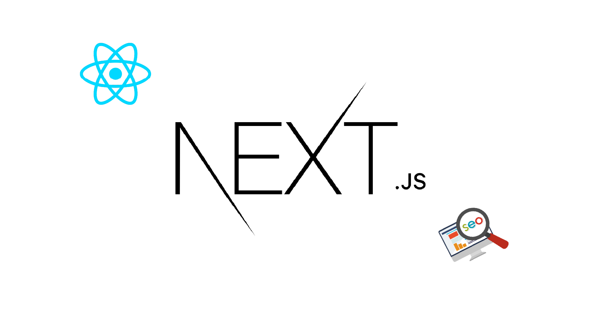

หลายๆคน คงเคยได้ยินชื่อของ Next.js กันมาบ้างแล้ว โดยส่วนตัวก็ได้ยินมาค่อนข้างเยอะ แต่ยังไม่ได้ลองมาศึกษาเองสักทีว่ามันคืออะไร
ในบทความนี้เลยจะมาลองเขียนภาพรวมคร่าวๆจาก Tutorial ที่ทางเว็บไซต์ Next.js ทำการสอนละกันนะครับ

## Next.js คือ
เว็บเฟรมเวิคที่ถูกพัฒนาขึ้นมาเพื่อ แก้ปัญหาหลักๆในด้านของการทำ SEO สามารถเป็นทั้ง Frontend และ Backend ได้ในตัวเดียวกัน
ภาษาหลักที่จะใช้ในเฟรมเวิคตัวนี้คือ React และสามารถขึ้นโปรเจ็คได้ง่ายมากโดยไม่ต้องมีการ config ใดๆ

### Features หลักๆที่น่าสนใจ
1. [page-based](https://nextjs.org/docs/basic-features/pages) routing system ก็คือ url ในเว็บไซต์จะเปลี่ยนไปตามเพจที่เราสร้าง
ยกตัวอย่างเช่น ถ้าเรามี folder ช่ือ pages อยู่ที่ root ภายใน pages folder มีไฟล์ชื่อ posts/page-1.md สามารถเข้าผ่าน http://localhost:8000/posts/page-1 ได้เลย
2. สามารถทำ [pre-rendering](https://nextjs.org/docs/basic-features/pages#pre-rendering) มีทั้งแบบ `static generation (SSG)` สำหรับไฟล์ที่มีเนื้อหาที่ไม่มีการเปลี่ยนแปลงไปกับ request
และ `server-side rendering (SSR)` สำหรับ request ที่มีการเปลี่ยนแปลงเนือหาบ่อยๆ
3. มีการ `Split code` โดยจะโหลด `code` เฉพาะหน้าที่เราเข้าถึงเท่านั้น ทำให้หน้าเว็บโหลดไวขึ้น
4. มี `built-in CSS` and `Sass support` โดยไม่ต้อง config อะไรเพิ่มเลย ของ sass อาจจะต้องมีการลง package เพิ่มนิดหน่อย การใช้ `CSS Modules` แค่ตั้งชื่อไฟล์ตามด้วย `.module.css` หรือ `.module.scss` ก็สามารถใช้งานได้แล้ว
เมื่อต้องการใช้ import ไฟล์ CSS Modules เข้าไปใช้งานใน Component และ `Next.js` คอมไฟล์ CSS สำหรับ `built-in CSS support` โดยใช้ [PostCSS](https://postcss.org/) ทำให้ไม่ต้องกังวลเรื่องของชื่อคลาสที่จะซ้ำกัน
5. `Next.js` มี `CSS-in-JS Support` ทำให้ `css` ในไฟล์นั้นจะถูก `scoped` แค่ไฟล์นั้นไม่ยุ่งเกี่ยวกับไฟล์อื่น เป็นอีกวิธีการนึงสำหรับคนที่มีปัญหาเรื่องของการใช้สไตล์ ที่ซ้ำซ้อนกันไปมา
```jsx
function HelloWorld() {
  return (
    <div>
      Hello world
      <p>scoped!</p>
      <style jsx>{`
        p {
          color: blue;
        }
        div {
          background: red;
        }
        @media (max-width: 600px) {
          div {
            background: blue;
          }
        }
      `}</style>
      <style global jsx>{`
        body {
          background: black;
        }
      `}</style>
    </div>
  )
}

export default HelloWorld
```
6. [API routes](https://nextjs.org/docs/api-routes/introduction) ไฟล์ที่อยู่ภายใต้ `pages/api` จะถูกแมพ ไปที่ `/api/*`
และจะถูกมองว่าเป็น `Api Endpoint` แทนที่จะเป็น `Page` ในส่วนของ `Api Endpoint` นั้นจะอยู่ในฝั่งของ server-side เท่านั้น
จะไม่ส่งผลให้ขนาดของ bundle size ฝั่ง client-side เพิ่มขึ้น

- ตัวอย่าง, Api route ต่อไปนี้ `pages/api/user.js` ส่ง `json response` กลับมาด้วย status code `200`:

```jsx
export default function handler(req, res) {
  res.status(200).json({ name: 'John Doe' })
}
```

การจะทำให้ Api route ใช้งานได้ต้อง export function as default เท่านั้นนะครับ

### สรุป
ส่วนตัวคิดว่า `Next.js` เป็น `Framework` ที่น่าสนใจตัวนึงเลยครับ เหมาะกับคนที่มีพื้นฐาน `Javascript` และ `React` เป็นอย่างมาก
และส่วนที่สำคัญก็คือด้วย `built-in Features` ต่างๆที่ทำให้หน้าเว็บมีการโหลดเนื้่อหาที่ค่อนข้างเร็ว ทำให้ส่งผลดีต่อการ `SEO` คิดว่าน่าจะเหมาะกับเว็บ Blog ทั้งหลาย
ส่วนการใช้งานแบบลงรายละเอียดลึกๆ ถ้ามีโอกาสได้ลองใช้งานจริงจังจะมาเขียนใน Blog ต่อๆไปละกันนะครับ จริงๆยังมีอีกหลายส่วนที่ยังไม่ได้พูดถึงใครอยากลองเล่นก็ไปทำตาม [Tutorial](https://nextjs.org/learn/basics/create-nextjs-app) ได้นะครับ
